# SwarmGuard


**Multi-agent incident response for cloud workloads: log anomaly detection, payment-event correlation and Zero-Trust containment, with a built-in evaluation harness.**

> **Status: early design stage.** The repo skeleton and the message contracts exist. There is no agent code yet. This README is updated in every pull request that changes the design.

## The problem

Cloud incidents rarely show up in a single place. A burst of failed card payments in Stripe, an odd traffic pattern in VPC flow logs and a spike in authentication errors can be the same attack, but each lives in a different tool and a different dashboard. Correlating them by hand is slow, and acting on them (blocking an IP range, rotating a secret) is risky without a paper trail.

## The idea

SwarmGuard is a small team of specialized agents that share structured messages instead of free text:

| Agent | Role |
|-------|------|
| **Scout** | Watches logs and payment events. Rules first, LLM only when a rule fires. Emits a `SuspicionSignal`. |
| **Investigator** | Takes a signal, pulls more context, correlates sources and produces hypotheses with a confidence level. |
| **Coordinator** | Decides what to do with a signal: discard, report, or propose a containment action. |

Containment actions are proposals by default and require human approval. Nothing is executed automatically in the early phases.

<p align="center">
  
</p>

## What will make it different: evaluation

Most multi-agent demos never measure whether the agents help. SwarmGuard will ship with synthetic incident scenarios that have a known correct answer, and report:

- detection rate and false positives
- cost per incident
- whether agent collaboration improves results compared with a single-agent baseline

## Message contracts

Agents communicate through JSON messages validated against schemas in [`schemas/`](schemas/). See [`docs/contracts.md`](docs/contracts.md) for what a contract is, why the project uses them and how they change.

- [`SuspicionSignal`](schemas/suspicion_signal.schema.json): emitted by Scout when it detects something suspicious. Required fields: id, timestamp, source agent, severity, summary and at least one piece of evidence that points to the original record.
- [`HypothesisReport`](schemas/hypothesis_report.schema.json): emitted by the Investigator after analyzing a signal. Required fields: id, timestamp, source agent, the `signal_id` it analyzed and at least one hypothesis. Each hypothesis has a title, an explanation, a confidence between 0 and 1, a category (including `benign` and `unknown`) and its own evidence.
- [`CoordinatorDecision`](schemas/coordinator_decision.schema.json): emitted by the Coordinator. It discards the signal, reports it or proposes an action, and points back to the signal and report it used. A proposal must be corroborated by at least two different evidence sources.
- [`GuardianAction`](schemas/guardian_action.schema.json): the Guardian's proposed containment action (Phase 4). Always a dry run that needs human approval, limited to a closed list of reversible action types, and it expires after at most one day.

## Security

SwarmGuard reads untrusted text and can propose infrastructure changes, so the safety model is part of the design. Agents propose, deterministic code decides, and containment needs human approval. See [docs/security.md](docs/security.md) for the threat model and the planned controls.

## Roadmap

- [x] **Phase 0 - Foundations:** repo skeleton and the four message schemas (`SuspicionSignal`, `HypothesisReport`, `CoordinatorDecision`, `GuardianAction`)
- [ ] **Phase 1 - MVP:** Scout, Investigator and Coordinator running locally on synthetic logs and Stripe test-mode events
- [ ] **Phase 2 - Evaluation harness:** synthetic scenarios, metrics, single-agent baseline
- [ ] **Phase 3 - Collaboration:** structured message passing and consensus between agents
- [ ] **Phase 4 - Actions:** Guardian agent in dry-run mode, human approval flow
- [ ] **Phase 5 - AWS:** real CloudWatch and WAF integrations, infrastructure as code

## Running the tests

```bash
python3 -m venv .venv
source .venv/bin/activate
pip install -r requirements-dev.txt
pytest
```

The tests check the four message schemas: that they are valid, that the evidence shape matches in the messages that carry it, and that example and broken messages behave as expected.

## Repository layout

```
src/swarmguard/agents/   agent implementations
schemas/                 JSON schemas for inter-agent messages
evals/scenarios/         synthetic incident scenarios
tests/                   contract tests and example messages
requirements-dev.txt     development dependencies (pytest, jsonschema)
docs/                    architecture and design documentation
```

## References

Documentation behind the technologies this project relies on:

- **Stripe:** [Webhooks](https://docs.stripe.com/webhooks), [Testing and test mode](https://docs.stripe.com/testing), [Radar (fraud prevention)](https://docs.stripe.com/radar)
- **AWS:** [CloudWatch Logs](https://docs.aws.amazon.com/AmazonCloudWatch/latest/logs/WhatIsCloudWatchLogs.html), [VPC Flow Logs](https://docs.aws.amazon.com/vpc/latest/userguide/flow-logs.html), [AWS WAF](https://docs.aws.amazon.com/waf/latest/developerguide/waf-chapter.html)
- **Local AWS emulation:** [Floci](https://github.com/floci-io/floci), an open-source local AWS emulator being evaluated for local development
- **Zero Trust:** [NIST SP 800-207, Zero Trust Architecture](https://csrc.nist.gov/pubs/sp/800/207/final)
- **LLM application security:** [OWASP Top 10 for LLM Applications (2025)](https://genai.owasp.org/llm-top-10/)
- **Agent tool security (open decision):** [Model Context Protocol specification](https://modelcontextprotocol.io/specification/latest), [MCP Security Best Practices](https://modelcontextprotocol.io/docs/tutorials/security/security_best_practices)
- **Adversary tactics against ML systems:** [MITRE ATLAS](https://atlas.mitre.org/)
- **Message contracts:** [JSON Schema specification](https://json-schema.org/specification)
- **Testing:** [pytest](https://docs.pytest.org/en/stable/), [jsonschema for Python](https://python-jsonschema.readthedocs.io/en/stable/)
- **Streaming (considered, not used yet):** [Apache Kafka documentation](https://kafka.apache.org/documentation/)
- **Diagrams:** [Mermaid](https://mermaid.js.org) and an animated SVG (SMIL)
- **Badges and icons:** [Shields.io](https://shields.io), [Simple Icons](https://simpleicons.org)

All product names, logos and brands are the property of their respective owners. They are used here only to identify the technologies involved. This project is not affiliated with or endorsed by them.

Agent frameworks and LLM providers will be listed here once they are chosen.

## License

MIT
