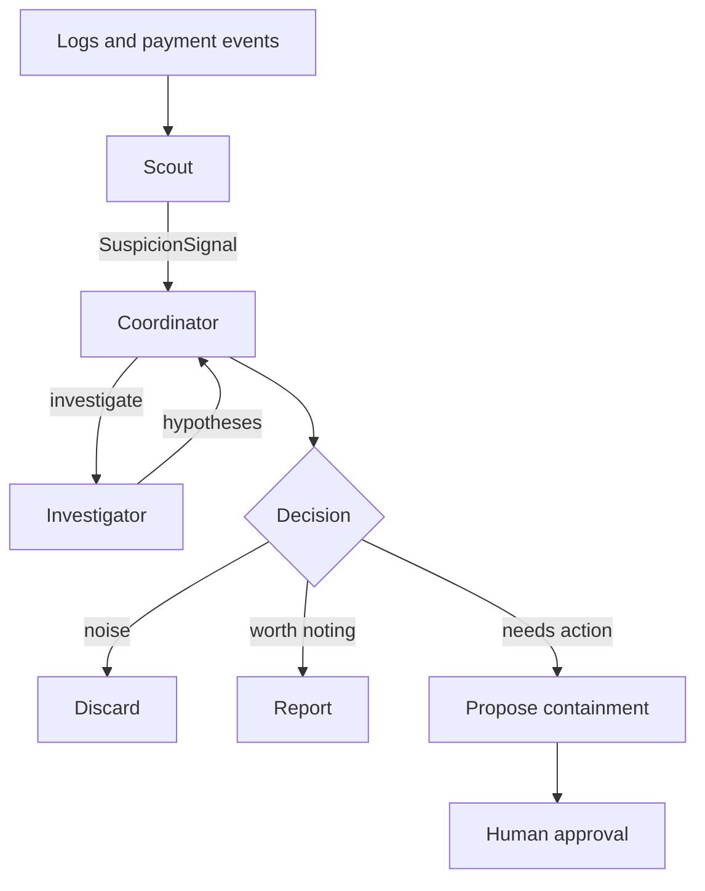

# SwarmGuard

**Multi-agent incident response for cloud workloads: log anomaly detection, payment-event correlation and Zero-Trust containment, with a built-in evaluation harness.**

> **Status: early design stage.** The repo skeleton and the first message contract exist. There is no agent code yet. This README is updated in every pull request that changes the design.

## The problem

Cloud incidents rarely show up in a single place. A burst of failed card payments in Stripe, an odd traffic pattern in VPC flow logs and a spike in authentication errors can be the same attack, but each lives in a different tool and a different dashboard. Correlating them by hand is slow, and acting on them (blocking an IP range, rotating a secret) is risky without a paper trail.

## The idea

SwarmGuard is a small team of specialized agents that share structured messages instead of free text:

| Agent | Role |
|-------|------|
| **Scout** | Watches logs and payment events. Rules first, LLM only when a rule fires. Emits a `SuspicionSignal`. |
| **Investigator** | Takes a signal, pulls more context, correlates sources and produces hypotheses with a confidence level. |
| **Coordinator** | Decides what to do with a signal: discard, report, or propose a containment action. |

Containment actions are proposals by default and require human approval. Nothing is executed automatically in the early phases.



## What will make it different: evaluation

Most multi-agent demos never measure whether the agents help. SwarmGuard will ship with synthetic incident scenarios that have a known correct answer, and report:

- detection rate and false positives
- cost per incident
- whether agent collaboration improves results compared with a single-agent baseline

## Message contracts

Agents communicate through JSON messages validated against schemas in [`schemas/`](schemas/).

- [`SuspicionSignal`](schemas/suspicion_signal.schema.json): emitted by Scout when it detects something suspicious. Required fields: id, timestamp, source agent, severity, summary and at least one piece of evidence that points to the original record.

## Roadmap

- [x] **Phase 0 - Foundations:** repo skeleton, `SuspicionSignal` schema
- [ ] **Phase 1 - MVP:** Scout, Investigator and Coordinator running locally on synthetic logs and Stripe test-mode events
- [ ] **Phase 2 - Evaluation harness:** synthetic scenarios, metrics, single-agent baseline
- [ ] **Phase 3 - Collaboration:** structured message passing and consensus between agents
- [ ] **Phase 4 - Actions:** Guardian agent in dry-run mode, human approval flow
- [ ] **Phase 5 - AWS:** real CloudWatch and WAF integrations, infrastructure as code

## Repository layout

```
src/swarmguard/agents/   agent implementations
schemas/                 JSON schemas for inter-agent messages
evals/scenarios/         synthetic incident scenarios
tests/                   automated tests
docs/                    architecture and design documentation
```

## License

MIT
