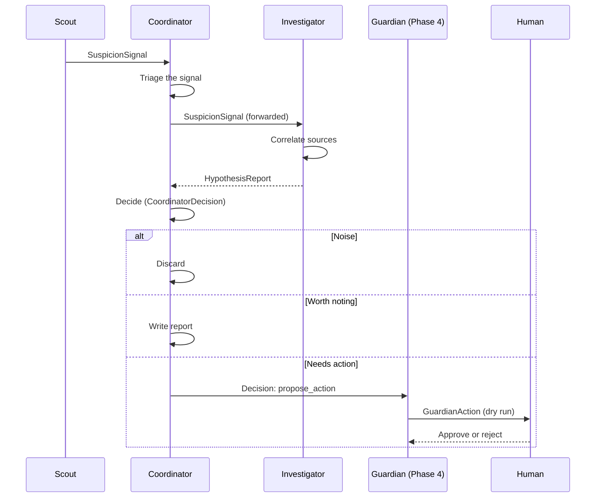

# Architecture

> **Status: design only.** None of the components below are implemented yet. This document describes the intended design and is updated in every pull request that changes it.

## Overview

SwarmGuard is a small team of specialized agents that exchange structured, schema-validated messages. Each agent has one job, its own permissions and a clear input and output. A human stays in the loop for any action that changes infrastructure.

## Agents

| Agent | Input | Output | Notes |
|-------|-------|--------|-------|
| **Scout** | Logs and payment events | `SuspicionSignal` | Deterministic rules run first. An LLM is called only when a rule fires, to summarize and structure the signal. |
| **Investigator** | A `SuspicionSignal` plus extra context | `HypothesisReport` | Correlates sources such as payment events and network logs. |
| **Coordinator** | Signals and hypothesis reports | `CoordinatorDecision`: discard, report or propose action | Triage and orchestration. Avoids contradictory actions. |

A fourth agent, **Guardian**, is planned for Phase 4. When the Coordinator decides `propose_action`, the Guardian turns that decision into a concrete `GuardianAction`, always a dry run, which a human approves or rejects. Until then there is no Guardian: a proposal from the Coordinator is shown to a human as a report and nothing is executed.

## Message flow

A typical incident goes through these steps. Every arrow is a structured message validated against a schema in [`schemas/`](../schemas/).

Four contracts exist today: `SuspicionSignal` (Scout to Coordinator), `HypothesisReport` (Investigator to Coordinator), `CoordinatorDecision` (the Coordinator's outcome) and `GuardianAction` (the Guardian's dry-run proposal, Phase 4). They link to each other by identifier, so an incident can be followed from signal to action. All four are defined before any agent code depends on them.

The Coordinator forwards the `SuspicionSignal` itself to the Investigator, so there is no separate "investigate" request message and no free text between agents.

Two messages do not have a contract yet and will get one before code depends on them:

- **Audit log record:** what each agent saw, proposed and decided. The monitor, the reviewer and the evaluation harness all read it, so it is the next contract to define (Phase 1 or 2).
- **Human approval record:** the approve or reject answer to a `GuardianAction` (Phase 4).

## Design decisions

### Rules first, LLM second

Scout applies deterministic rules before any model call. This keeps cost predictable and gives the evaluation harness a rules-only baseline to compare against.

### Normalize before correlating

Stripe events, VPC flow logs and application logs have different shapes. A small normalizer per source converts each one to a common shape (timestamp, source, IP address, account identifier, event type), so correlation becomes a join on shared keys instead of a comparison of free text. A full ETL pipeline is not needed for the MVP.

### Message passing

Early phases pass messages in memory or through files. A managed queue is a later option. Kafka-style streaming is only worth considering if log volume or replay requirements justify it.

### Human approval by default

Containment actions are proposals. Nothing that changes infrastructure runs without explicit approval.

### Local first

Development starts with synthetic data and a local AWS emulator. Real AWS comes in a later phase, once the agents and the evaluation harness work.

### Evidence shape is copied, not shared

Both message contracts describe evidence the same way: a source, a reference to the original record, an optional excerpt and an observation time. The definition is copied into each schema instead of shared through a common file, because it keeps each schema readable on its own and reviewable in one place. The trade-off is that a change must be made in both. An automated test that compares the copies (`tests/test_schemas.py`) fails if they differ, and once a third message needs the same shape it should move to a shared schema referenced from all of them.
