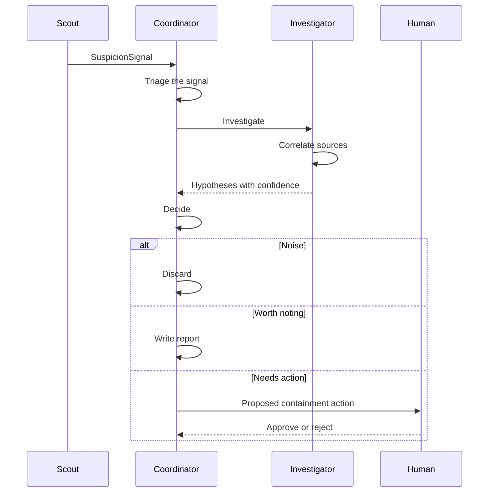

# Architecture

> **Status: design only.** None of the components below are implemented yet. This document describes the intended design and is updated in every pull request that changes it.

## Overview

SwarmGuard is a small team of specialized agents that exchange structured, schema-validated messages. Each agent has one job, its own permissions and a clear input and output. A human stays in the loop for any action that changes infrastructure.

## Agents

| Agent | Input | Output | Notes |
|-------|-------|--------|-------|
| **Scout** | Logs and payment events | `SuspicionSignal` | Deterministic rules run first. An LLM is called only when a rule fires, to summarize and structure the signal. |
| **Coordinator** | Signals and hypotheses | Decision: discard, report or propose action | Triage and orchestration. Avoids contradictory actions. |
| **Investigator** | A signal plus extra context | Hypotheses with a confidence level | Correlates sources such as payment events and network logs. |

A fourth agent, **Guardian**, is planned for a later phase. It turns an approved decision into a concrete containment action, in dry-run mode first.

## Message flow

A typical incident goes through these steps. Every arrow is a structured message validated against a schema in [`schemas/`](../schemas/).

Two contracts exist today: `SuspicionSignal` (Scout to Coordinator) and `HypothesisReport` (Investigator to Coordinator). The decision and action messages will get their own schemas in later pull requests, before any agent code depends on them.

## Design decisions

### Rules first, LLM second

Scout applies deterministic rules before any model call. This keeps cost predictable and gives the evaluation harness a rules-only baseline to compare against.

### Normalize before correlating

Stripe events, VPC flow logs and application logs have different shapes. A small normalizer per source converts each one to a common shape (timestamp, source, IP address, account identifier, event type), so correlation becomes a join on shared keys instead of a comparison of free text. A full ETL pipeline is not needed for the MVP.

### Message passing

Early phases pass messages in memory or through files. A managed queue is a later option. Kafka-style streaming is only worth considering if log volume or replay requirements justify it.

### Human approval by default

Containment actions are proposals. Nothing that changes infrastructure runs without explicit approval.

### Local first

Development starts with synthetic data and a local AWS emulator. Real AWS comes in a later phase, once the agents and the evaluation harness work.

### Evidence shape is copied, not shared

Both message contracts describe evidence the same way: a source, a reference to the original record, an optional excerpt and an observation time. The definition is copied into each schema instead of shared through a common file, because it keeps each schema readable on its own and reviewable in one place. The trade-off is that a change must be made in both. An automated test that compares the copies is planned, and once a third message needs the same shape it should move to a shared schema referenced from all of them.
